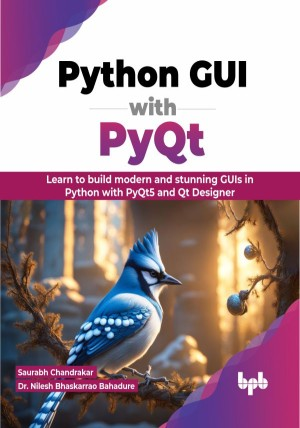

# Python GUI with PyQt 

Master the art of GUI development in Python with this comprehensive guide

This is the repository for [Python GUI with PyQt
](https://bpbonline.com/products/python-gui-with-pyqt?variant=43049448374472),published by BPB Publications.

## About the Book
Python GUI with PyQt is an invaluable guide for both novice and experienced programmers who want to master the art of creating visually appealing and interactive graphical user interfaces (GUIs) for Python applications using the PyQt5 library and the Qt Designer visual layout tool. It covers all the essential concepts of PyQt5 GUI programming in a comprehensive and beginner-friendly manner.

The book starts with the basics of GUI programming, such as creating windows, using layout managers, and managing signals and events. It then covers more advanced topics, such as creating dialog and message boxes, using container, input, item views, and display widgets. Then it teaches you to connect signals to slots, the cornerstone of event-driven programming, and discover how to utilize Qt Designer, a visual GUI design tool, to streamline the development process. As you progress, delve into the realm of containers, learning to organize and manage widgets with finesse. Explore the vast array of input widgets, enabling users to seamlessly provide data. You finally conclude your journey by mastering the art of display widgets, empowering you to present information with clarity and elegance. The book is also highly interactive, with practical examples and exercises at the end of each chapter. These help you solidify your understanding of the concepts and gain practical experience in PyQt5 GUI programming.

Overall, this is an excellent book for anyone who wants to learn how to create GUI applications in Python using PyQt5 and Qt Designer.

## What You Will Learn
• Practice your code in various IDEs, such as VS Code and Jupyter Notebook.

•  Write comments against your code to make it more readable and maintainable.

•  Discover different types of widgets available in Qt Designer, such as buttons, labels, text boxes, check boxes, radio buttons, drop-down menus, item views, and container widgets. 

•  Explore the different layout management options available in PyQt5, such as vertical, horizontal, form, and grid layouts.

•  Learn about the unique signals and slots mechanism in PyQt5 for handling events.

•  Create dialogs and message boxes using the PyQt5 library. User interaction approaches are covered in detail.  

